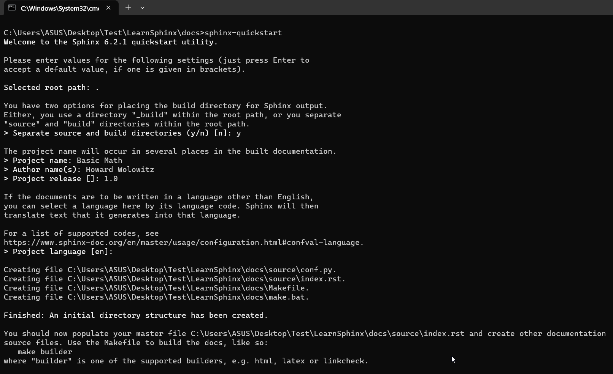
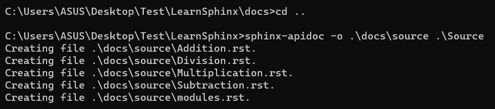
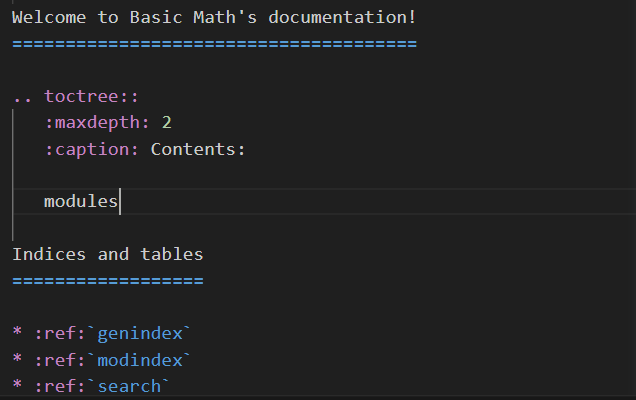

# LearnSphinx

## Start Sphinx
Install the sphinx packages
```
pip install sphinx
pip install sphinx_rtd_theme
```
Clone the repository 
```
git clone https://github.com/rajeshrimal516/Learn-sphinx-with-python

cd LearnSphinx/docs

sphinx-quickstart

```
Fill according to the screenshot below.




```
cd ..

sphinx-apidoc -o .\docs\source .\Source

```
The .rst files are created in ***docs\source*** folder.



Add modules in the index.rst file like shown in image below.



## Changes in conf.py file
You need to make changes in the conf.py file located at ***docs/source/conf.py***. 

Copy paste the code from below snippet. Remember to update with your Project information.

```
# Configuration file for the Sphinx documentation builder.
#
# For the full list of built-in configuration values, see the documentation:
# https://www.sphinx-doc.org/en/master/usage/configuration.html

import os
import sys
sys.path.append(os.path.abspath('../..'))
sys.path.append(os.path.abspath('../../Source'))

# -- Project information -----------------------------------------------------
# https://www.sphinx-doc.org/en/master/usage/configuration.html#project-information

project = 'Basic Math'
copyright = '2023, Howard Wolowitz'
author = 'Howard Wolowitz'
release = '1.0'

# -- General configuration ---------------------------------------------------
# https://www.sphinx-doc.org/en/master/usage/configuration.html#general-configuration

extensions = [
    'sphinx.ext.autodoc',
    'sphinx.ext.viewcode',
    'sphinx.ext.napoleon'
]

templates_path = ['_templates']
exclude_patterns = []

# -- Options for HTML output -------------------------------------------------
# https://www.sphinx-doc.org/en/master/usage/configuration.html#options-for-html-output

html_theme = 'sphinx_rtd_theme'
html_static_path = ['_static']

```

## Generate HTML

```
cd docs\
make html
```
The html file is generated and ready at ***docs/build/html/index.html***

## Reference
1. https://www.sphinx-doc.org/en/master/usage/quickstart.html#getting-started
